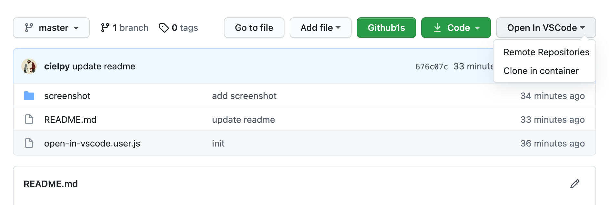

A tool that let you open a repo in VSCode quickly, with [Remote Repositories](https://code.visualstudio.com/blogs/2021/06/10/remote-repositories) feature.

Screenshot

### Usage

Install [Tampermonkey](https://www.tampermonkey.net/) or [Violentmonkey](https://violentmonkey.github.io/) first

Open https://github.com/cielpy/open-in-vscode/raw/master/open-in-vscode.user.js

Install it!